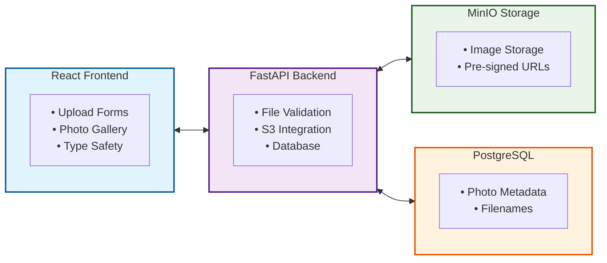

# Image Upload Demo: Complete Full-Stack Tutorial

This tutorial demonstrates how to build a complete image upload system using FastAPI for the backend and React for the frontend, with S3-compatible storage (MinIO) for image hosting.

## Tutorial Structure

This lesson is split into two parts that can be completed independently or together:

### [Part 1: Backend Implementation](LESSON-PART1.md)
**FastAPI + S3 Integration**

Learn how to build a robust backend API for image uploads:

- Setting up FastAPI with file upload endpoints
- Integrating with S3-compatible storage (MinIO/AWS S3)
- Implementing security validation (file types, sizes)
- Using pre-signed URLs for secure image access
- Database integration with SQLAlchemy
- Environment-based configuration management

**Technologies**: FastAPI, boto3, SQLAlchemy, PostgreSQL, MinIO

### [Part 2: Frontend Implementation](LESSON-PART2.md)
**React + TypeScript Upload Components**

Build modern, user-friendly upload interfaces:

- Simple file input upload component
- Advanced drag-and-drop upload with preview
- Type-safe API integration with result patterns
- Client-side validation for better UX
- Modern React patterns (hooks, TypeScript, form actions)
- Error handling and state management

**Technologies**: React 19, TypeScript, Tailwind CSS, React Router

---

## Quick Start

1. **Clone and Setup**:
   ```bash
   git clone <repository>
   cd image-upload-demo
   ```

2. **Backend Setup** (see [Part 1](LESSON-PART1.md)):
   ```bash
   cd backend
   docker compose up -d
   python -m venv .venv
   source .venv/bin/activate
   pip install -r requirements.txt
   cp .env.sample .env
   fastapi dev
   ```

3. **Frontend Setup**:
   ```bash
   cd frontend
   npm install
   npm run dev
   ```

4. **Access**:
   - Frontend: http://localhost:5173
   - Backend API: http://localhost:8000/docs
   - MinIO Console: http://localhost:9001

---

## Learning Outcomes

After completing this tutorial, you'll understand:

### Backend Skills
- File upload handling in web APIs
- S3-compatible storage integration
- Security best practices for file uploads
- Database design for file metadata
- Environment configuration management

### Frontend Skills
- Modern React file upload patterns
- Drag-and-drop implementation
- Type-safe API integration
- Client-side validation strategies
- Error handling without exceptions

### Full-Stack Integration
- CORS configuration
- FormData handling
- Error response consistency
- Security validation layers

---

## Prerequisites

- **Backend**: Python 3.11+, basic FastAPI knowledge
- **Frontend**: Node.js 18+, basic React knowledge
- **General**: Docker for MinIO/PostgreSQL

---

## Architecture Overview



---

## Next Steps

1. Start with [Part 1: Backend Implementation](LESSON-PART1.md) to build the API foundation
2. Continue with [Part 2: Frontend Implementation](LESSON-PART2.md) to create the user interface
3. Deploy to production (see DEPLOYMENT.md for hosting guides)

Each part is self-contained with complete code examples and explanations.